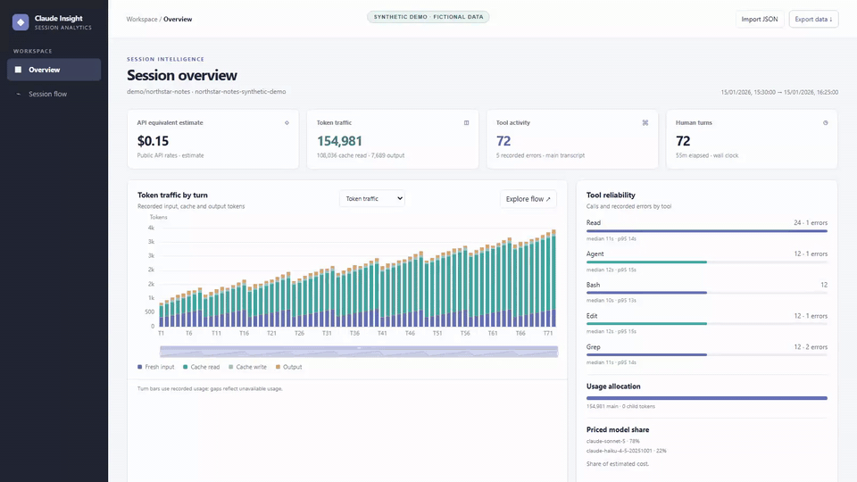
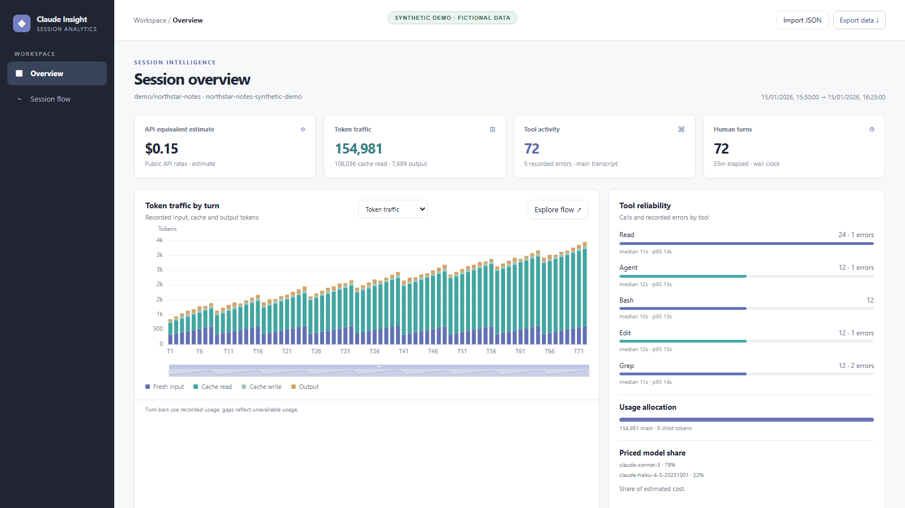
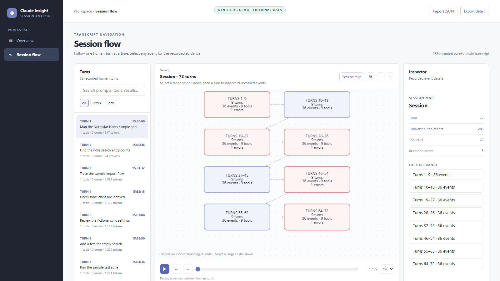
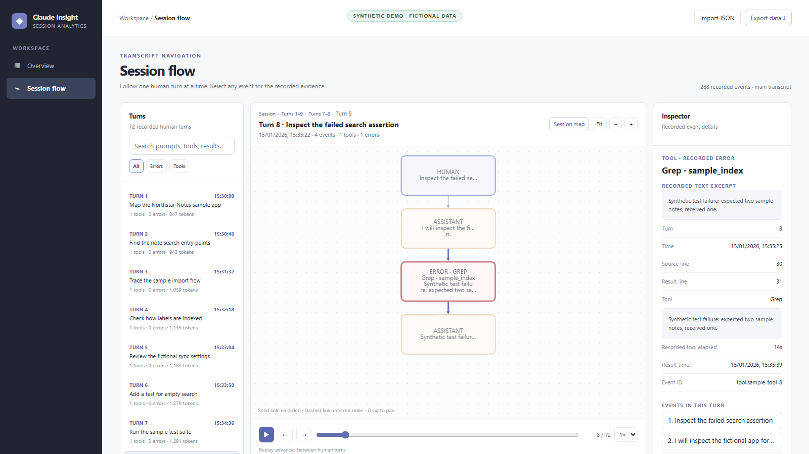

<p align="center"></p>
<h1 align="center">claudeinside</h1>
<p align="center"><strong>Claude Session Insight</strong><br>Explore Claude Code sessions through readable maps, charts, and recorded events.</p>
<p align="center">
  
  <a href="LICENSE"></a>
  
  
</p>

A Python library and CLI for exploring Claude Code JSONL sessions. It reads transcripts and exports a standalone, animated HTML report. The viewer works offline: no server, CDN, account, or browser extension is required.

**Contents:** [See it in action](#see-it-in-action) · [Install and try it](#install-and-try-it) · [Read from S3 or GCS](#read-sessions-from-s3-or-gcs) · [Python API](#python-api) · [Extend it](#extend-it) · [Prices and limits](#prices-and-limits) · [License](#license)

## See it in action

This animated preview shows a **fabricated 72-turn session** for a fictional sample app. Click it for the [full silent MP4 walkthrough](docs/media/demo.mp4). Every frame is synthetic; no real transcript, account, or project data appears.

[](docs/media/demo.mp4)

The walkthrough opens the overview, drills from session ranges to a turn, and inspects a simulated tool failure. Still images show the details:

| Session overview | Large-session map |
| --- | --- |
|  |  |



For maintainers: run `python scripts/generate_public_media.py`, then `python scripts/generate_demo_preview.py` to recreate the screenshots, MP4, and GIF. Capture uses Playwright Chromium and ffmpeg; neither is needed to run the demo. The [media manifest](docs/media/manifest.json) records SHA-256 hashes and synthetic provenance.

For maintainers: before committing or pushing this folder, run `python scripts/public_release_audit.py --check`. Private session exports and generated reports stay here under `.gitignore`; the audit checks the files Git would include, including anything force added. See the [release procedure](docs/PUBLIC_RELEASE.md).

## Install and try it

On GitHub, choose **Code → Download ZIP**, extract the ZIP, then open a terminal in the extracted folder containing `pyproject.toml`. You need Python 3.9 or newer with pip and venv, plus a modern browser.

Windows PowerShell:

```powershell
py -3 -m venv .venv
.\.venv\Scripts\python.exe -m pip install .
.\.venv\Scripts\claude-insight.exe --demo --graph demo.html
```

macOS or Linux:

```sh
python3 -m venv .venv
.venv/bin/python -m pip install .
.venv/bin/claude-insight --demo --graph demo.html
```

Open `demo.html` in your browser. The bundled demo is synthetic; it needs no Node.js, API key, or Claude account. To inspect your own session, supply a Claude Code JSONL transcript. In the examples below, use `.\.venv\Scripts\claude-insight.exe` on Windows or `.venv/bin/claude-insight` on macOS/Linux in place of `claude-insight`; no environment activation is needed.

```sh
claude-insight path/to/session.jsonl --graph session.html
claude-insight path/to/session.jsonl --json
claude-insight path/to/session.jsonl --events
claude-insight path/to/session.jsonl --search "test failed"
claude-insight path/to/sessions --json
```

`--events`, `--search`, and exported HTML include transcript excerpts. Default reports print counts and metadata only. Graphs stay on your machine unless you share the HTML file.

If `py` or `python3` is missing, install Python 3.9+ with pip and venv, then reopen the terminal. On Linux, a missing pip or venv module may need your distribution's `python3-pip` or `python3-venv` package. Put paths containing spaces in quotes, for example `"my sessions/session.jsonl"`.

## Read sessions from S3 or GCS

Cloud access is optional. Install the extra into the same `.venv` you created above. Supply a bucket prefix for a report across JSONL files, or one JSONL object for an HTML graph.

Windows PowerShell:

```powershell
.\.venv\Scripts\python.exe -m pip install '.[cloud]'
.\.venv\Scripts\claude-insight.exe s3://example-bucket/sessions/ --json
.\.venv\Scripts\claude-insight.exe gs://example-bucket/sessions/demo.jsonl --graph cloud-session.html
```

macOS or Linux:

```sh
.venv/bin/python -m pip install '.[cloud]'
.venv/bin/claude-insight s3://example-bucket/sessions/ --json
.venv/bin/claude-insight gs://example-bucket/sessions/demo.jsonl --graph cloud-session.html
```

The Python API accepts the same sources: `inspect("s3://example-bucket/sessions/")` and `write_graph("gs://example-bucket/sessions/demo.jsonl", "cloud-session.html")`. The Python process reads cloud data using credentials already available to it; the browser only opens the resulting local HTML. S3 uses the usual AWS environment, profile, or runtime role credentials; GCS uses [Application Default Credentials](https://docs.cloud.google.com/docs/authentication/application-default-credentials), such as `GOOGLE_APPLICATION_CREDENTIALS` or a runtime identity. Signing in with `gcloud auth login` alone does not configure ADC. A `.env` file is not loaded automatically. See the [s3fs](https://s3fs.readthedocs.io/en/latest/api.html) and [gcsfs](https://gcsfs.readthedocs.io/en/stable/api.html) credential documentation for setup.

## Python API

```python
from claude_insight import graph_data, inspect, render_graph, session_files, write_graph

report = inspect("path/to/sessions")
path, opener = next(session_files("path/to/session.jsonl"))
data = graph_data(path, opener)
html = render_graph(data)  # HTML string for your own app or file
write_graph("path/to/session.jsonl", "session.html")
```

The simplest embed keeps the standalone offline behavior:

```html
<iframe src="session.html" title="Claude session graph" style="width:100%;height:750px;border:0"></iframe>
```

For direct mounting, export reusable assets and JSON:

```python
import json
from pathlib import Path
from claude_insight import graph_data, session_files, write_viewer_assets

path, opener = next(session_files("path/to/session.jsonl"))
data = graph_data(path, opener)
out = Path("site")
out.mkdir(exist_ok=True)
write_viewer_assets(str(out))  # site/viewer.css and site/viewer.js
(out / "graph.json").write_text(json.dumps(data, ensure_ascii=False), encoding="utf-8")
```

```html
<link rel="stylesheet" href="viewer.css">
<div id="session-viewer"></div>
<script src="viewer.js"></script>
<script>
fetch("graph.json").then(response => response.json()).then(data => {
  const host = document.getElementById("session-viewer");
  const view = window.ClaudeInsight.mount(host, data, {initialTurn: 0});
  host.addEventListener("claude-insight:select", event => console.log(event.detail.node));
  // Later: view.setData(nextData), view.select(nodeId), view.fit(), view.destroy().
});
</script>
```

Serve `site/` with `python -m http.server` for the JSON fetch; browsers often block `fetch` from `file://`. The standalone HTML and iframe work directly from disk. `viewer_assets()` also returns the CSS and JavaScript as strings when a host app manages its own assets. Direct mounting creates a viewer inside the supplied element; `getData()` returns the current graph.

The versioned graph schema (`schema_version: 1`) includes `nodes`, `edges`, `turns`, `tools`, `usage`, `insights`, `cost`, and `analytics`. A node has `id`, `type` (`user`, `assistant`, or `tool`), `label`, `text`, `timestamp`, `line`, `parent_id`, `turn`, `tool_name`, `model`, `usage`, `estimated_usd`, and `is_error`. Tool nodes also carry `result_line`, `result_time`, and `duration_seconds` when available. An edge has `source`, `target`, and `type`. The legacy `turns`, `tools`, and `cost` fields remain available.

The viewer accepts graph-shaped JSON from other sources through `ClaudeInsight.mount(element, data)` or `view.setData(data)`. Supply `nodes` with unique IDs, optional `turn` IDs, and `edges` with `source` and `target` IDs; explicit `turns` and `analytics` improve the summaries. When `turns` are absent, the viewer groups nodes by their recorded turn IDs. Missing analytics are displayed as unavailable instead of treated as measured zero. Invalid top-level JSON input is rejected without replacing the current mounted report.

Open **Session flow** for a whole-session map. Its range cards cover every human turn in chronological order; select a range to drill down until individual turns appear, then select a turn for four-event graph pages and the recorded event inspector. Breadcrumbs and **Session map** return to earlier levels. Selecting an event through the API or a chart bar goes straight to its turn; the map remains one click away. Dashed range-map links indicate chronological order only; solid event links reflect recorded graph edges. The map keeps a bounded number of cards on screen so large sessions remain readable. `getViewState()` continues to expose `scale` and `offset` alongside the current view and turn.

The analyst workspace uses `analytics.turns`, `analytics.tools`, `analytics.models`, `analytics.totals`, `analytics.slowest_calls`, and evidence-linked `analytics.findings`. Turn elapsed time is the observed wall-clock span from a human prompt to the last event before the next prompt; tool timing is the observed span from call to result, including waits. These are not CPU or active-work timings. Tool p95 uses the nearest-rank method over calls with recorded result times; pending or untimed calls are excluded. `peak_request_input_tokens` is the largest single main assistant request in a turn, including fresh input, cache writes, and cache reads; it is not a context-window capacity estimate. Token totals add fresh input, cache writes, cache reads, and output. Cache read share divides recorded cache reads by fresh input plus cache writes plus cache reads; it is unavailable when that denominator is zero. Cost is calculated from deduplicated message usage snapshots. Session totals include discovered child transcripts, while turn totals include only children linked to a turn; `unattributed_tokens`, `unattributed_priced_subtotal_usd`, and `unlinked_child_count` show the remainder. `estimated_usd` is null if any record cannot be priced, while `priced_subtotal_usd` includes only priced records. No cache-savings amount is inferred. `first_timestamp`, `last_timestamp`, and `duration_seconds` describe the observed record span.

The graph and charts use packaged Cytoscape.js and Apache ECharts, with no CDN. Their versions, source archives, and licenses are listed in `src/claude_insight/vendor/README.md`.

## Extend it

Register a source for a custom URI scheme or an insight that produces JSON-compatible data:

```python
from claude_insight import register_source, register_insight

class MySource:
    def can_open(self, source):
        return source.startswith("my://")
    def session_files(self, source):
        # Yield (display_path, zero-argument text-stream opener).
        yield "my://example", lambda: open("example.jsonl", encoding="utf-8")

class MyInsight:
    name = "assistant_count"
    def analyze(self, graph):
        return sum(node["type"] == "assistant" for node in graph["nodes"])

register_source(MySource())
register_insight(MyInsight())
```

The registry is process local. Insight results appear under `data["insights"][name]`; return JSON-compatible values if the graph will be exported. A failed insight is isolated and appears as `{ "error": "..." }`. Plugins receive the full graph, including excerpt text. Do not register untrusted plugin code.

## Prices and limits

Cost is an **API-equivalent estimate**, never a Claude subscription bill. The built-in exact-ID rates are from [Anthropic's public pricing page](https://platform.claude.com/docs/en/about-claude/pricing), checked 2026-09-19. Recorded input, output, cache writes by duration, and cache reads are priced separately. Unknown model IDs, missing cache duration, nonstandard service tiers or speeds, and unconfigured server tool rates make `estimated_usd` null. The graph shows a priced subtotal and reasons for incomplete pricing. No guessed rate is applied. Contract discounts and other metered services are not included.

Supply your own exact-model USD-per-million-token rates with `--prices rates.json` when exporting a graph:

```json
{
  "my-exact-model-id": {
    "input": 5, "cache_5m": 6.25, "cache_1h": 10,
    "cache_read": 0.5, "output": 25, "web_search_request": 0.01
  }
}
```

The parser skips malformed JSONL lines, deduplicates streaming snapshots by message ID using maximum token counters, and deduplicates tool uses by tool ID. Child transcripts are included in cost when their task IDs can be linked. Session text may include secrets; inspect exported HTML before sharing it. Other Claude product transcript formats are outside this parser's scope.

## License

claudeinside is released under the [MIT License](LICENSE).
